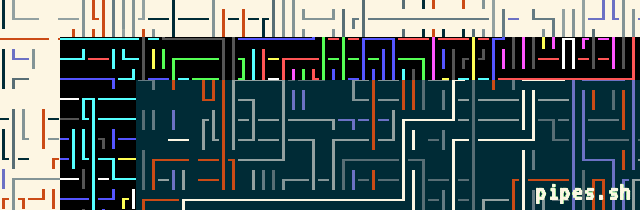

========
pipes.sh
========

  *Animated pipes terminal screensaver.*

  Screenshot of pipes.sh.

.. contents:: **Contents**
   :local:
   :backlinks: top

A Brief History
===============

pipes.sh was originally created by @msimpson and posted to the `Arch Linux Forums`_
in early 2010. It was also later posted to Gist_ with a license clarification.

.. _Arch Linux Forums: https://bbs.archlinux.org/viewtopic.php?pid=728932#p728932
.. _Gist: https://gist.github.com/msimpson/1096939

In early 2013 @livibetter posted a modification of the script to Gist_ after reading
about it on a blog_ where it was maintained for a few months.

.. _Gist: https://gist.github.com/livibetter/4689307
.. _blog: http://inconsolation.wordpress.com/2013/02/01/pipes-sh-a-little-bit-of-fun/

In 2014 the script was given its own GitHub repo which encouraged contributions
from other developers. As the script gained more popularity the decision was made
to combine forces with developers of similar projects (such as this C version).
Finally, in 2015 the Pipeseroni_ collective was formed.

.. _Pipeseroni: https://github.com/pipeseroni

In 05/06/2015 AcidHub_ with his BlackXT_ GitHub account forked this project and 
made the git as light as possible only for archive purposes.

.. _AcidHub: mailto:acidhub@craft.net.br
.. _BlackXT: https://github.com/BlackXT

Requirements
============

* Bash 4+.

Options
=======

``-p [1-]        number of pipes (D=1).``

``-t [0-8]       type of pipes, can be used more than once (D=0).``

``-t c[16 chars] custom type of pipes.``

``-f [20-100]    framerate (D=75).``

``-s [5-15]      probability of a straight fitting (D=13).``

``-r LIMIT       reset after x characters, 0 if no limit (D=2000).``

``-R             random starting point.``

``-B             no bold effect.``

``-C             no color.``

``-h             help.``

``-v             print version number.``

Controls
========

Press any key to exit the program.

Contribution
============

Feel free to fork and/or create pull request. But if you does create pull requests, that means you agree to put your contribution in *public domain*.

