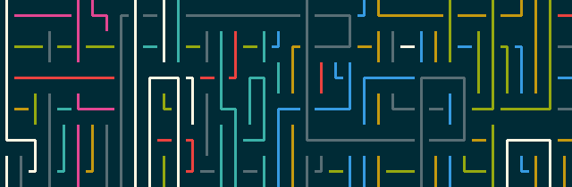
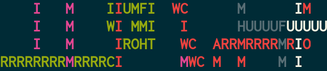

========
pipes.sh
========

  *Animated pipes terminal screensaver.*

.. note on taking the screenshots

  Font is Inconsolata, font size 24 as in 16x35 pixel per character

  Image size is 640x210. A sample command, where terminal at +0+18,
  window border is 2, terminal is urxvt, seems to 2 pixels as padding:

  xsnap -region 640x210+$((2+2))+$((20+2)) -file i/pipes.png



  Screenshot of pipes.sh, click to watch a screencast_ on YouTube.

.. _screencast: http://youtu.be/q_nYfR6CVEY

.. contents:: **Contents**
   :local:
   :backlinks: top


Requirements
============

* Bash 4+ since version 1.0.0.


Installation
============

If you want to install, you can run:

.. code:: sh

  $ make install

By default, it installs to ``/usr/local``; for user home, you can run:

.. code:: sh

  $ make PREFIX=$HOME/.local install

Or any ``PREFIX`` you prefer.

The ``Makefile`` also provides ``uninstall`` target.

If you are a `Homebrew <http://brew.sh>`_ user, you can install via:

.. code-block:: sh

    $ brew install pipes-sh


Options
=======

Full List
---------

===============  ============================================================
Options          Descrptions (Defaults)
===============  ============================================================
``-p [1-]``      Number of pipes (1)
``-t [#]``       Type of pipes, can be used more than once (0)
``-c [0-7]``     Color of pipes, can be used more than once (1 2 3 4 5 6 7 0)
``-f [20-100]``  Framerate (75)
``-s [5-15]``    Probability of a straight fitting (13)
``-r LIMIT```    Reset after x characters, 0 if no limit (2000)
``-R``           Random starting point
``-B``           No bold effect
``-C``           No color
``-K``           Pipes keep their color and type when hitting the screen edge
``-h``           Help message
``-v``           Print version number
===============  ============================================================


``-t [#]``: pipe types
----------------------

.. note on taking the screenshots

  Font is Inconsolata, font size 24 as in 16x35 pixel per character

  Image size is 480x140. A sample command, where terminal at +0+18,
  window border is 2, terminal is urxvt, seems to 2 pixels as padding:

  xsnap -region 480x140+$((2+2))+$((20+2)) -file i/pipes.t#.png

+----------+------------------------+----------------------------+
| ``-t #`` | Characters             | Screenshots                |
+==========+========================+============================+
| ``-t 0`` | ``┃┏ ┓┛━┓  ┗┃┛┗ ┏━``   | .. figure:: i/pipes.t0.png |
+----------+------------------------+----------------------------+
| ``-t 1`` | ``│╭ ╮╯─╮  ╰│╯╰ ╭─``   | .. figure:: i/pipes.t1.png |
+----------+------------------------+----------------------------+
| ``-t 2`` | ``│┌ ┐┘─┐  └│┘└ ┌─``   | .. figure:: i/pipes.t2.png |
+----------+------------------------+----------------------------+
| ``-t 3`` | ``║╔ ╗╝═╗  ╚║╝╚ ╔═``   | .. figure:: i/pipes.t3.png |
+----------+------------------------+----------------------------+
| ``-t 4`` | ``|+ ++-+  +|++ +-``   | .. figure:: i/pipes.t4.png |
+----------+------------------------+----------------------------+
| ``-t 5`` | ``|/ \/-\  \|/\ /-``   | .. figure:: i/pipes.t5.png |
+----------+------------------------+----------------------------+
| ``-t 6`` | ``.. ....  .... ..``   | .. figure:: i/pipes.t6.png |
+----------+------------------------+----------------------------+
| ``-t 7`` | ``.o oo.o  o.oo o.``   | .. figure:: i/pipes.t7.png |
+----------+------------------------+----------------------------+
| ``-t 8`` | | ``-\ /\|/  /-\/ \|`` | .. figure:: i/pipes.t8.png |
|          | | (railway)            |                            |
+----------+------------------------+----------------------------+
| ``-t 9`` | | ``╿┍ ┑┚╼┒  ┕╽┙┖ ┎╾`` | .. figure:: i/pipes.t9.png |
|          | | (knobby)             |                            |
+----------+------------------------+----------------------------+


``-t c[16 chars]``: custom pipe
-------------------------------

For example, ``-t cMAYFORCEBWITHYOU``.

.. note on taking the screenshot

  Font is Inconsolata, font size 24 as in 16x35 pixel per character

  Image size is 640x140. A sample command, where terminal at +0+18,
  window border is 2, terminal is urxvt, seems to 2 pixels as padding:

  xsnap -region 640x140+$((2+2))+$((20+2)) -file i/pipes.tc.png




``-c [0-7]``: colors
--------------------

+---+------------+---+------------+---+------------+---+------------+
| 0 | background | 1 | red        | 2 | green      | 3 | yellow     |
+---+------------+---+------------+---+------------+---+------------+
| 4 | blue       | 5 | magenta    | 6 | cyan       | 7 | foreground |
+---+------------+---+------------+---+------------+---+------------+


Controls
========

Press any key to exit the program, except the following :kbd:`Shift` +
:kbd:`Key`:

===================  ======================================================
Keys                 Actions
===================  ======================================================
:kbd:`P` / :kbd:`O`  Increase/decrease probability of straight pipes
:kbd:`F` / :kbd:`D`  Increase/decrease frame rate
:kbd:`B`             Toggle bold effect
:kbd:`C`             Toggle no colors
:kbd:`K`             Toggle keeping pipe color and type when crossing edges
===================  ======================================================


History
=======

pipes.sh was originally created by Matthew Simpson and posted to the `Arch
Linux Forums`__ in early 2010. It was also later posted to Gist__ released in
the public domain.

__ https://bbs.archlinux.org/viewtopic.php?pid=728932#p728932
__ https://gist.github.com/msimpson/1096939

In early 2013, Yu-Jie Lin posted a modification of the script to Gist after
reading about it on a blog__ It was maintained on Gist independently for a
period of a few months.

__ https://inconsolation.wordpress.com/2013/02/01/pipes-sh-a-little-bit-of-fun/

In 2014 the script was given its own GitHub repository as a project which
encouraged contributions from other developers. As the project gained more
popularity the decision was made to combine forces with developers of similar
projects.

Finally, in 2015, the MIT License was added and the Pipeseroni_ collective was
formed to maintain the project.

.. _Pipeseroni: https://pipeseroni.github.io/


Reporting an Issue
==================

* `Reporting a bug`__

__ https://github.com/pipeseroni/pipes.sh/issues/new?template=BUG.md&title=Brief+bug+summary


Contribution
============

Feel free to fork and/or create pull request following the guideline_. If
you're contributing, remember your changes will be released under the MIT
license.

.. _guideline: CONTRIBUTING.rst


Copyright
=========

pipes.sh is licensed under the MIT License.
